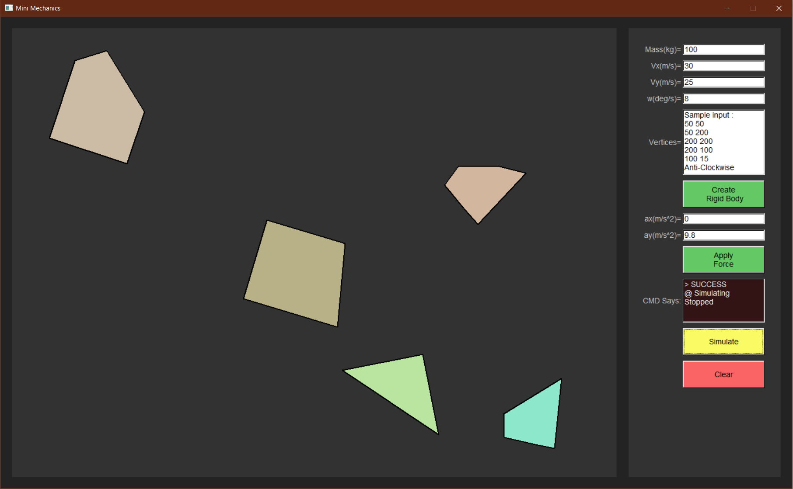

# 总报告

## 问题及背景

为了帮助同学们更好地学习物理，更加形象地理解刚体的碰撞，本项目开发了一个模拟多刚体碰撞的图形界面，可以随心所欲地加入不同形状的刚体并且模拟他们碰撞的过程。

## 开发计划和分工

甘特图可见本目录下plan/Gantt.pdf

| 工作                       | 计划时间（第xx天） | 人员     |
| -------------------------- | ------------------ | -------- |
| 确定课题                   | 2-4                | 全体组员 |
| 学习C++的使用              | 1-4                | 全体组员 |
| 创建github工程、熟悉VS使用 | 1-2                | 全体组员 |
| 持续集成及自动化部署       | 2-3                | 胡泳欢   |
| 刚体类与碰撞实现           | 4-6                | 胡泳欢   |
| Model层实现                | 6-8                | 胡泳欢   |
| 控件及Window层实现         | 8-9                | 胡泳欢   |
| Common层基础实现           | 4-6                | 钟添芸   |
| MVVM框架搭建及App层实现    | 6-8                | 钟添芸   |
| ViewModel层实现            | 6-9                | 钟添芸   |
| Command及Parameter实现     | 6-8                | 钟添芸   |
| 寻找合适的图形库，熟悉使用 | 3-6                | 江昊翰   |
| 搭建程序框架               | 3-4                | 江昊翰   |
| View层实现                 | 6-9                | 江昊翰   |

## 每轮迭代效果说明

| 轮次 | 说明                                                         | 效果图与演示视频                                 |
| :--: | :----------------------------------------------------------- | ------------------------------------------------ |
|  1   | 前后端链接,通过命令与反馈实现后端运算、前端绘制. 实现了创建刚体与通知绘制两个功能. | images & videos/1.png images & videos/1.mp4 |
|  2   | 优化碰撞算法. 优化绘图效率. 实现模拟的任意开始与停止. 实现施加力场功能. 实现清屏功能. 在View层增加了操作反馈.  | images & videos/2.png images & videos/2.mp4 |

**数据作为参数进行传递,并非正统MVVM的数据绑定.*

## 最终运行效果图

程序界面简洁，左侧为刚体所在的物理空间，右侧为操作栏。支持**创建任意多边形刚体**、**指定刚体的各初态量**、**开始/停止模拟**、**向空间添加力场**及**清屏**。所有操作都会在操作栏的迷你命令行得到反馈。