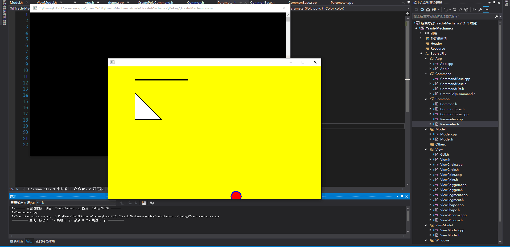

江昊翰 3180101995

## 设计思路

#### 搭建程序框架

对于一个刚体力学模拟器，程序框架还是十分清晰的。最底层Common需要有存储各个层都需要用到的枚举类型及基本类，在物理世界中最基本的类就是向量（Vector），还需要在Common层里加上向量的各种运算，以及由向量类继承出来的多边形类（Polygon），而Model层侧重于物理碰撞的计算，故需要在多边形类的基础之上再添加质量、速度、转动惯量等信息，而View层则需要把这些信息展现出来，需要一个合适的图形库以及控制窗口的各种插件（Button、Slider、Textbox等）

#### 寻找合适的图形库

由于没有学过OOP，对C++也不是特别熟悉，所以在本项目中需要一个尽量简单的图形库，只要能实现窗口、多边形绘制、按钮等小插件的功能就可以了。看过MFC、Qt等大型库，发现并不需要那么多的功能，使用起来也非常麻烦，最后决定使用FLTK这个较为容易上手的库实现想要的操作

#### View层实现

View层为了统一化管理图形、插件，需要从基本类开始，创建一个最基本的类，其它的类都从这个类派生出来，在基类中实现一个纯虚函数用于绘图，再在派生类中根据形状的不同重新定义这个函数，以实现不同形状的绘制

## 解决方案

#### 搭建程序框架

1. Common层构架

   向量类Vec：要求实现用于物理计算的向量类，包括：向量运算（加减乘除点乘叉乘平移旋转），向量存取

   线段类Segment：存储两个向量类变量作为成员，代表线段的两个端点，类内实现线段的平移，旋转等计算

   多边形类Poly：以逆时针存储一个向量类的vector作为成员，代表多边形的每个端点，实现平移及旋转等操作

   圆形类Circle（后因需求变化删去）：存储一个Vec类型成员作为圆心，一个double类型变量作为圆的半径，要求实现圆的放大缩小平移等操作

   刚体类RigidBody：由Poly类继承，加上物体的质量，转动惯量（默认物体是匀质的），速度，角速度，加速度，角加速度的信息

2. Model层框架

   需要实现物体的碰撞方程的计算，包括碰撞的判定，碰撞后速度和角速度的计算、并把信息传递到ViewModel

#### View层实现

1. ViewPoint：View层的最基础类，从Vec类继承而来，由于FLTK库需要使用像素点坐标，加入getintX()和getintY()两个函数

2. ViewShape：View层图形类的最基础类，在View层所有的图形通过特有的id进行管理，所以ViewShape类仅储存id和visible（图形是否可见）两个变量，定义纯虚函数draw()要求每个派生类实现自己的绘制函数

3. ViewPolygon：本来与ViewSegment和ViewCircle同作为ViewShape的派生类，但后两者因为程序需求的改变而删去，ViewPolygon的成员有一个ViewPoint组成的vector，管理所有顶点。成员变量还有线宽、边界的颜色以及内部的颜色等。该类必须支持回传顶点数量等操作，并调用FLTK库里的方法（例如多边形使用startPolygon函数和endPolygon函数实现）实现draw函数。

   创建多边形时考虑到用户可能不喜欢设置那么多参数，故提供一套默认的模板：

   m_DEFAULT_LINEWIDTH：默认多边形线宽

   m_DEFAULT_LINECOLOR：默认多边形边缘颜色

   m_DEFAULT_FILLCOLOR：默认多边形填充颜色

   m_DEFAULT_VISIBLE：默认多边形可见状态

   同样设置可以改变这些默认设定的函数

4. ViewWindow：从Fl_Double_Window继承而来，实现一整个窗口的绘制，成员变量包括这个页面上所有多边形的集合vector\<ViewPolygon\> ，成员函数drawwindow实现了把整个页面上所有的shape画出来，包括polygon、circle和shape

   同样地设定一套默认模板：

   m_DEFAULT_TOPLEFT：默认窗口左上角坐标

   m_DEFAULT_WINWIDTH：默认窗口宽度

   m_DEFAULT_WINHEIGHT：默认窗口高度

   m_DEFAULT_WINCOLOR：默认窗口背景色

   m_DEFAULT_WINVISIBLE：默认窗口可见状态

   同样提供一套可以改变默认设定的函数

5. ViewSystem：由于整个系统可能会包括多个窗口，所以需要一个系统来管理所有的window，后来发现这个类其实就是后面谈到的View

   这个system本质上是一个ViewWindow*型的vector，并有一个储存着当前操作窗口的变量m_DEFAULT_WINDOW ，所有多边形的操作都在这个窗口上进行。

   窗口的操作通过对窗口的查询实现，像每个shape都有独特的id一样，我们要求窗口有独特的name

6. View：对外提供接口，包含窗口的创建，窗口的改变参数（宽度、高度等），窗口的删除，操作窗口的改变，窗口上多边形的创建、改变、删除等

## 运行效果图

可以显示出线段、多边形和圆形的效果图如下：

## 课程心得体会

最终做完验收的时候才意识到我们做的项目并不是MVVM模式，这里的View层实际上只是把图形库加工一下设计出一个简单易懂的接口而已，真正的View层更应当实现把和ViewModel共有的数据库中的数据用图像的形式显示出来，在View中应当实现UI层面的设计以及回调函数的运行，并传递给ViewModel通知。View层和ViewModel没法解耦时，往往需要在ViewModel里设计调用View的函数，两个人需要统一接口，属实不方便

通过这门课让我真正认识了工程开发中良好框架和前沿工具使用的必要性。使用持续集成及自动化部署可以省去很多不必要的时间。View层和Model层的解耦也可以增加这两个层的开发人员的开发自由度，减去不必要的统一接口等工作。

最后，认识到了自己基础知识仍然不足的问题，小学期的前半段一直停留在找合适的图形库和学习C++上，很多的工具例如共享指针等到最后使用的也不是特别熟练，debug时间非常长。

## 课程建议

建议在预修要求中加入OOP

建议多加一些对MVVM模式的例子的讲解

